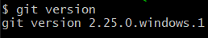
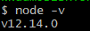
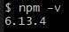
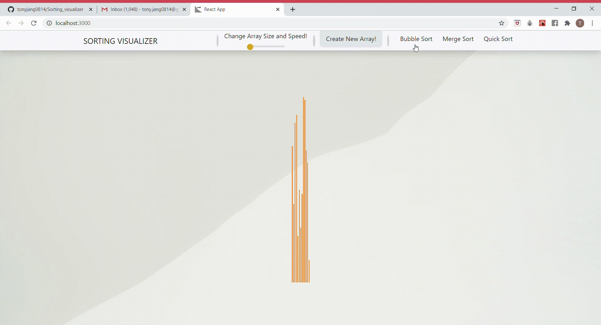
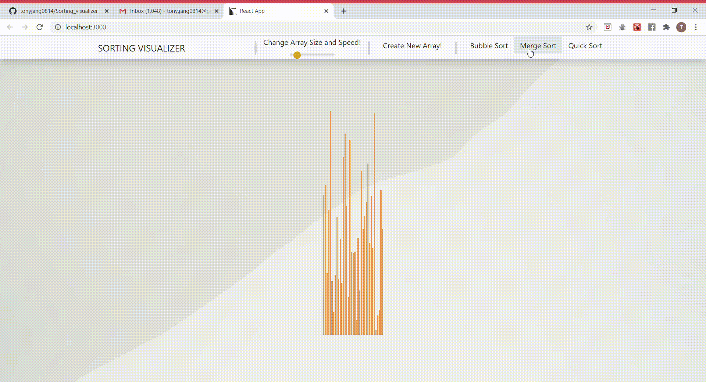
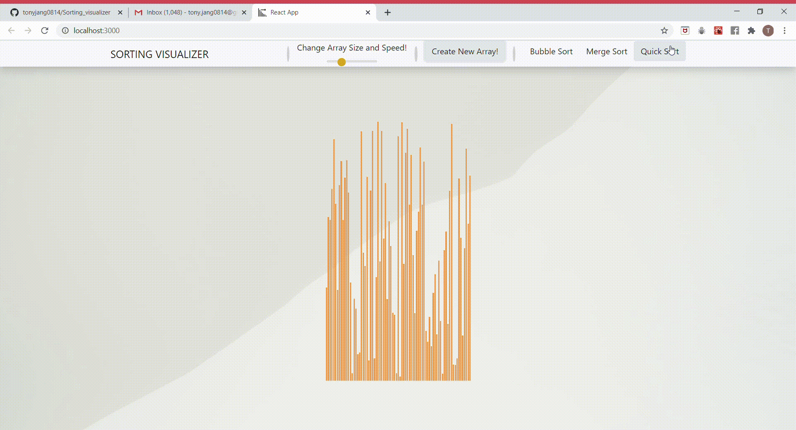

##      INTRODUCTION
Welcome Everyone! I built this web application since i was interested in different types of sorting algorithms.
In the following link of website, you can visualise 3 different sorting algorithms. Bubble Sort, Quick Sort and Merge Sort.
The step by step guide is provided so that you can download this repo and play around with my project!
Thank you!

##      HOW TO PLAY WITH IT?
To play around with the project, you will need the following or higher version of tools.
###     Version explanation (Environment setups)
You will require following environment settings.
1. Git version

2. Node

        
3. npm

###     Step by step installments
1. make sure you have satisfied environemnt settings as discussed above.
2. clone this repositery by typing >> git clone https://github.com/tonyjang0814/Sorting_visualizer.git <<
3. cd into the repositery and and make sure you are in the right directory or repositery.
4. Type >> npm start << on terminal and wait for few seconds until local host page loads up.
5. Enjoy your time!

##      WHAT IS IN THIS PROJECT
###     Features (visual demonstrations)
1. Bar adjustments

The visualisation of sorting algorithms are represented by arrangement of multiple bars.
Each bar has same thickness but different lengths. Number of bars can be adjusted by your choice.

2. Sorting Algorithms

Bubble Sort

Merge Sort

Quick Sort

